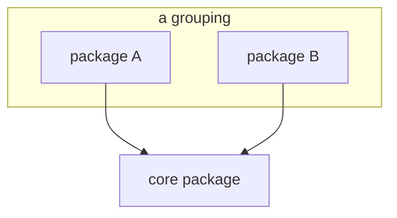
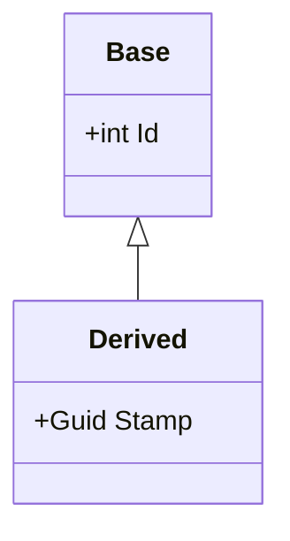

# Mermaid diagram types to offer

When the user wants diagrams, present these as a multi-select (they may pick one or more). Then place the
chosen types where they fit best in the README and docs pages. Use fenced ```mermaid blocks.

| Type | Good for | Mermaid opener |
|---|---|---|
| **Flowchart** | Package/module dependencies, process/decision flow | ` ```mermaid\nflowchart TB` |
| **Class diagram** | Type hierarchies, interfaces, data models | ` ```mermaid\nclassDiagram` |
| **Sequence diagram** | Request/response, call order between components | ` ```mermaid\nsequenceDiagram` |
| **Entity-relationship** | Database schemas, table relations | ` ```mermaid\nerDiagram` |
| **State diagram** | Lifecycles, status machines | ` ```mermaid\nstateDiagram-v2` |
| **Component / architecture (flowchart with subgraphs)** | High-level system layout | ` ```mermaid\nflowchart TB` + `subgraph` |

For a library/SDK, a good default pair is **flowchart** (package dependencies, with `subgraph`) and
**classDiagram** (core models and type hierarchies).

## Examples

Flowchart with subgraphs (dependency map):



Class diagram (model / hierarchy):



Keep diagrams accurate to the real code. A diagram that misrepresents the structure is worse than none.
