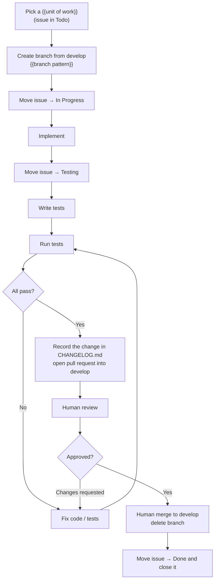

<!--
GUIDANCE — delete this comment block in the generated file.

Source: the APPROVED initial/Workflow.md. This document is its normative
formalization — same stages, same gates, same Definition of Done, expressed as
process rather than as instructions to an implementer.

Do NOT re-derive the process. If this document and initial/Workflow.md disagree on
a stage, a branch name, or a gate, the approved initial/Workflow.md wins and this
document is corrected to match. Change a rule only where the initial documents
specify something different.

Substitutions mirror the Workflow template: {{unit of work}}, {{UNIT}},
{{branch pattern}}, {{branch pattern example}}, {{branch example}},
{{test command}}. Use the SAME values here as in initial/Workflow.md.

`develop` is the integration branch: every unit of work is branched from it and
merged back into it. `main` only receives `release/x.y.z` branches; the branching
model and the release process are in CONTRIBUTING.md, which Step 9 links.
-->

# Development Workflow Document — {{Project Name}}

## 1. Purpose

This document defines **how a {{unit of work}} moves from backlog to merged** —
the branch, the issue status transitions, the testing gate, and the pull request.
It is the standard every contributor (human or agent) follows so that each
{{unit of work}} in the
[Use Case Specification Document](Use%20Case%20Specification%20Document.md) is
delivered the same way.

It complements the
[Testing Specification Document](Testing%20Specification%20Document.md), which
defines *how* the tests themselves are written; this document defines *when* they
happen in the delivery flow.

> **One {{unit of work}} = one branch = one issue = one pull request.**

## 2. Workflow at a glance



## 3. Issue status lifecycle

| Order | Status | Set when |
| --- | --- | --- |
| 1 | **Todo** | The {{unit of work}} has not been started (default). |
| 2 | **In Progress** | A branch has been created and implementation has begun. |
| 3 | **Testing** | Implementation is finished; tests are being written, run, and fixed until green. |
| 4 | **Done** | The pull request has been reviewed and merged into `develop`; the issue is then **closed**. |

An issue only ever moves **forward** during normal flow. If review requests
changes, work continues on the same branch (still linked to the same issue) until
tests pass again and the pull request is re-reviewed.

## 4. Step-by-step

### Step 1 — Branch from `develop`

Every {{unit of work}} is implemented on its own branch, created from an
up-to-date `develop`, the integration branch. `main` only ever receives release
branches (see [Step 9](#step-9--releases)):

```bash
git switch develop
git pull
git switch -c {{branch pattern example}}
```

**Branch naming pattern:**

```
{{branch pattern}}
```

| {{unit of work}} | Branch |
| --- | --- |
| {{UNIT}}-01: {{Name}} | {{branch example}} |

### Step 2 — Move the issue to **In Progress**

As soon as the branch exists and work starts, set the issue `Status` to
**In Progress**.

### Step 3 — Implement

Implement per its specification (main flow and alternative flows) and the
project's architecture and technology stack. All commits go on the branch.

### Step 4 — Move the issue to **Testing**

When the implementation is finished, set the issue `Status` to **Testing**. This
signals that the work is code-complete and the testing gate is now in progress.

### Step 5 — Test until green

Following the
[Testing Specification Document](Testing%20Specification%20Document.md):

1. Write the tests for the main flow and each applicable `AF-xx` alternative flow.
2. **Run the tests** (`{{test command}}`).
3. **Fix** any failures — in the implementation or the tests.
4. **Re-run**, and repeat until every test passes.

A {{unit of work}} does not leave the Testing stage until the full suite is green.

### Step 6 — Record the change and open a pull request

With all tests passing, record the change on the same branch:

- Add an entry under `## [Unreleased]` in [CHANGELOG.md](../CHANGELOG.md), under
  the heading that fits (`Added`, `Changed`, `Fixed`, …), describing what a user
  or operator would notice.
- If the root README tracks the backlog, mark the {{unit of work}}'s row done.

Both land with the implementation, in the same pull request. Then push the branch
and open a pull request into `develop`. The description references the
{{unit of work}} and its issue (e.g. `Closes #<issue-number>`).

### Step 7 — Human review and merge

- The pull request is **reviewed by a human**. Requested changes are addressed on
  the same branch (back to Step 5 whenever code changes, so the suite stays green).
- Once approved, a human **merges the pull request into `develop`**.
- The **branch is deleted** after the merge.

> Review and merge are **human actions**. An agent may prepare and push the pull
> request, but must not self-approve or merge it.

### Step 8 — Close the issue

After the merge, set the issue `Status` to **Done** and **close** it.

### Step 9 — Releases

A {{unit of work}} is done once it is merged into `develop`; it reaches users in
the next release. Releases are cut from `develop` as `release/x.y.z` branches
and merged into `main`, where the release is tagged `vx.y.z`. The branching model,
the Branch Policy check that enforces it, and the release steps are in
[CONTRIBUTING.md](../CONTRIBUTING.md).

## 5. Definition of Done

A {{unit of work}} is done only when **all** of the following hold:

- [ ] Implemented on a `{{branch pattern}}` branch created from `develop`.
- [ ] Main flow and every alternative flow from the specification are implemented.
- [ ] Tests cover it per the Testing Specification.
- [ ] The full test suite passes.
- [ ] The change is recorded under `## [Unreleased]` in `CHANGELOG.md`, and the
      README backlog row (if the README tracks one) is marked done, in the same
      pull request.
- [ ] A pull request into `develop` was reviewed by a human and merged.
- [ ] The branch was deleted.
- [ ] The issue is in **Done** and closed.

## 6. References

- [Use Case Specification Document](Use%20Case%20Specification%20Document.md) — the {{unit of work}} definitions and their flows.
- [Testing Specification Document](Testing%20Specification%20Document.md) — how the tests are written.
- [System Requirements Document](System%20Requirements%20Document.md) — functional/non-functional requirements.
- [Technology Stack Document](Technology%20Stack%20Document.md) — technologies and versions used.
- [CONTRIBUTING.md](../CONTRIBUTING.md) — building, testing, the branching model, versioning, and releasing.
