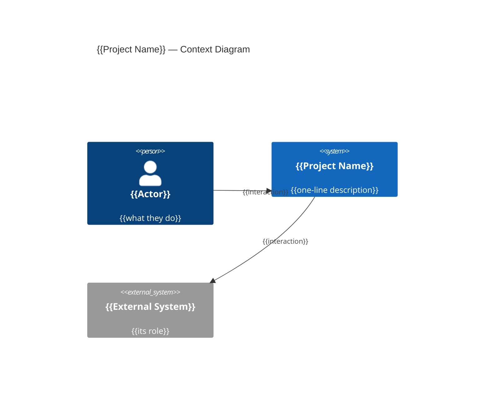

<!--
GUIDANCE — delete this comment block in the generated file.

Source: initial/Project Overview.md (primary), initial/Business Rules.md (domain
model, roles), plus the Phase 2 Vision questions from references/gap-questions.md.

The Vision Document is the "why and what, at altitude" document. It states no
versions, no endpoints, no field types — those belong to the Technology Stack and
System Requirements documents. Keep every section; drop a subsection only when the
project genuinely has no such dimension (e.g. a single-actor tool has no role
hierarchy), and say so in one line rather than leaving an empty heading.
-->

# Vision Document — {{Project Name}}

## 1. Introduction

### 1.1 Purpose

<!-- One paragraph: what this document establishes, and what the system is. -->

### 1.2 Scope

<!-- What the system covers and what it explicitly does not. Carry the non-goals
     from the Project Overview here. -->

### 1.3 Definitions and Acronyms

| Term | Definition |
| --- | --- |
| **{{Term}}** | {{Definition}} |

<!-- Every domain noun used anywhere in the requirements folder is defined here or
     in System Requirements §1.3. Bold the term. -->

---

## 2. Problem Statement

<!-- The pain that justifies building this. Concrete, not aspirational marketing. -->

---

## 3. Product Position Statement

| Attribute | Description |
| --- | --- |
| **For** | {{target audience}} |
| **Who** | {{their need}} |
| **The {{Project Name}}** | Is a {{product category}} |
| **That** | {{key benefit}} |
| **Unlike** | {{the status quo it replaces}} |
| **Our product** | {{primary differentiation}} |

---

## 4. Stakeholders

| Stakeholder | Role | Concern |
| --- | --- | --- |
| {{Stakeholder}} | {{role}} | {{what they care about}} |

---

## 5. High-Level Architecture



---

## 6. Core Features

| ID | Feature | Description |
| --- | --- | --- |
| F-01 | {{Feature}} | {{what it does}} |

<!-- These F-xx IDs are traced to requirement ranges in System Requirements §Traceability. -->

---

## 7. Domain Model Overview

```mermaid
erDiagram
    {{ENTITY_A}} ||--o{ {{ENTITY_B}} : {{relationship}}
    {{ENTITY_A}} {
        {{type}} {{Field}}
    }
```

<!-- Follow the diagram with prose only where a relationship needs explaining —
     unusual cardinality, an entity that deliberately lacks a foreign key, or an
     identifier strategy. Do not restate the diagram in words. -->

---

## 8. Roles Hierarchy

```mermaid
graph TD
    {{ROLE_HIGH}}["{{High Role}}"]
    {{ROLE_LOW}}["{{Low Role}}"]
    {{ROLE_HIGH}} -->|{{what it may do}}| {{ROLE_LOW}}
```

| Role | Relationship | Permissions |
| --- | --- | --- |
| **{{Role}}** | {{how it relates to the domain}} | {{what it may do}} |

<!-- Omit this section entirely if the system has exactly one kind of actor. -->

---

## 9. Constraints

<!-- Bulleted. Hard limits and invariants that shape the design: mandated
     platform, domain rules that must always hold, compliance obligations.
     Reference the Technology Stack Document for the platform rather than naming
     versions here. -->

- {{Constraint}}

---

## 10. Success Criteria

<!-- Bulleted, observable outcomes. Each one should be checkable against a running
     system, not a feeling. -->

- {{Criterion}}
